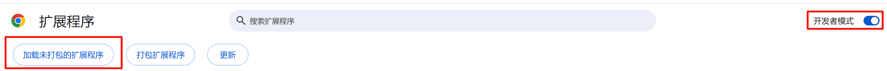
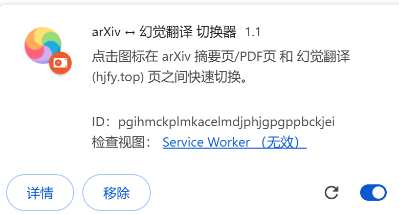

# ArXiv ↔ 幻觉翻译 切换器

  

一键在 arXiv (PDF/abs) 页面与 [幻觉翻译](https://hjfy.top/) 页面之间**双向切换**。

## 功能特性

- **双向识别**：自动识别 arXiv 页面（`abs` 和 `pdf` 路径）和幻觉翻译页面
- **arXiv → 幻觉翻译**：支持从 arXiv 摘要页或 PDF 页跳转到对应的幻觉翻译页
- **幻觉翻译 → arXiv**：支持从幻觉翻译页跳回到 arXiv 摘要页
- **页面链接**：在 arXiv 摘要页自动添加"幻觉翻译"快捷链接
- **快捷键支持**：`Ctrl+Shift+H`（Mac: `Cmd+Shift+H`）快速切换
- **智能定位**：新标签页智能定位到当前标签右侧
- **现代规范**：基于 Manifest V3 规范开发

## 安装方法

1. 打开浏览器扩展程序页面 `chrome://extensions/`（或 Edge 的 `edge://extensions/`）
2. 在页面右上角，**打开"开发者模式"**

    

3. 下载本仓库（点击 `Code` -> `Download ZIP`），并**解压缩**
4. 点击左上角的"**加载未打包的扩展程序**"，选择解压后的文件夹
5. 加载成功后即可使用

    

## 使用方法

| 方式 | 操作 |
|------|------|
| 点击图标 | 点击浏览器右上角的插件图标 |
| 快捷键 | 按下 `Ctrl+Shift+H`（Mac: `Cmd+Shift+H`） |
| 页面链接 | 在 arXiv 摘要页点击"幻觉翻译"链接 |

## 使用示例

**arXiv → 幻觉翻译**
- `https://arxiv.org/abs/2410.07087v1` → `https://hjfy.top/arxiv/2410.07087`

**幻觉翻译 → arXiv**
- `https://hjfy.top/arxiv/2410.07087` → `https://arxiv.org/abs/2410.07087`

## 致谢

本项目基于 [guantongpeng/arxiv-hjfy-extension](https://github.com/guantongpeng/arxiv-hjfy-extension) 修改。感谢原作者 [Tongpeng Guan](https://github.com/guantongpeng)。

## 许可证

MIT © [yuchenwu73](https://github.com/yuchenwu73/ArXiv-Hjfy-Switcher)
