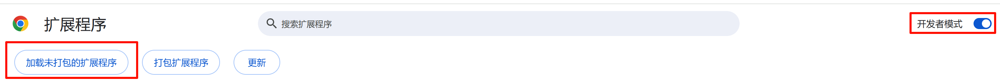
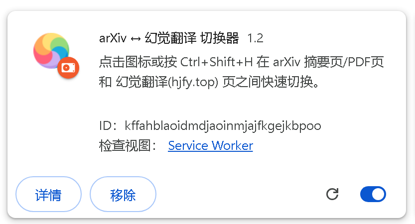

# ArXiv ↔ 幻觉翻译 切换器

<p align="left">
  
</p>

一键在 arXiv (PDF/abs) 页面与 [幻觉翻译](https://hjfy.top/) 页面之间**双向切换**。

## 功能特性

- **双向识别**：自动识别 arXiv 页面（`abs` 和 `pdf` 路径）和幻觉翻译页面
- **arXiv → 幻觉翻译**：支持从 arXiv 摘要页或 PDF 页跳转到对应的幻觉翻译页
- **幻觉翻译 → arXiv**：支持从幻觉翻译页跳回到 arXiv 摘要页
- **页面链接**：在 arXiv 摘要页自动添加"幻觉翻译"快捷链接
- **快捷键支持**：`Ctrl+Shift+H`（Mac: `Cmd+Shift+H`）快速切换
- **智能定位**：新标签页智能定位到当前标签右侧
- **现代规范**：基于 Manifest V3 规范开发

## 安装方法

### 1. 下载并解压

点击 GitHub 页面右上方绿色的 `Code` 按钮 → `Download ZIP`，将下载的压缩包**解压**到你喜欢的位置（例如 `D:\Extensions\`）。

解压后你会得到一个文件夹（名字类似 `ArXiv-Hjfy-Switcher-main`），打开它应该能看到如下文件：

```
ArXiv-Hjfy-Switcher-main/      ← 安装时要选的就是这个文件夹！
├── manifest.json              ← 关键标识文件，必须存在
├── background.js
├── content.js
├── icons/
├── assets/
└── README.md
```

> 💡 **判断标准**：你选择的文件夹里必须能**直接看到 `manifest.json`**，不能再往里或往外多一层。

### 2. 打开浏览器扩展页面

在地址栏输入并回车：

- **Chrome**：`chrome://extensions/`
- **Edge**：`edge://extensions/`

### 3. 打开开发者模式

在扩展页面的**右上角**找到"**开发者模式**"开关，打开它。



### 4. 加载扩展

1. 点击页面**左上角**的"**加载未打包的扩展程序**"按钮
2. 在弹出的文件选择窗口中，找到第 1 步解压出的 `ArXiv-Hjfy-Switcher-main` 文件夹
3. **选中这个文件夹**（不要双击进入），然后点击"**选择文件夹**"



### 5. 验证安装

- 扩展列表中出现"**ArXiv ↔ 幻觉翻译 切换器**"即安装成功
- 浏览器右上角工具栏会出现本扩展的图标
- 建议点击图标右侧的📌图钉将其固定，方便使用

> ⚠️ **常见错误**：如果弹出"未找到 manifest"的错误提示，说明选错了文件夹层级 —— 请确认选中的文件夹里能直接看到 `manifest.json` 文件。

## 使用方法

| 方式 | 操作 |
|------|------|
| 点击图标 | 点击浏览器右上角的插件图标 |
| 快捷键 | 按下 `Ctrl+Shift+H`（Mac: `Cmd+Shift+H`） |
| 页面链接 | 在 arXiv 摘要页点击"幻觉翻译"链接 |

## ⚠️ 快捷键不生效？

这是 Chrome 的**已知机制**，不是 bug：当 `Ctrl+Shift+H` 已被其他扩展占用时，Chrome 会**静默拒绝**分配该快捷键，需要手动设置。

> 💡 **为什么不能代码强制占用？**
> Chrome 的安全设计：快捷键归**用户所有**，扩展**无权**读写自己的快捷键字段，也**无法**通过 API 动态注册。多个扩展声明同一快捷键时**先到先得**，后来者必须由用户手动分配。

### 🎁 贴心机制：首次安装自动打开设置页

为了减少你的困扰，本扩展在**首次安装时**会**自动检测**快捷键是否分配成功：

- ✅ 分配成功 → 安静无感知，直接按 `Ctrl+Shift+H` 使用
- ⚠️ 分配失败（被占用）→ 自动打开 `chrome://extensions/shortcuts` 页，你只需点一下输入框并按下快捷键即可完成设置

### 手动设置步骤

如果你错过了自动弹窗，或想修改快捷键：

1. 在浏览器地址栏输入并回车：
   - Chrome：`chrome://extensions/shortcuts`
   - Edge：`edge://extensions/shortcuts`

2. 找到 **arXiv ↔ 幻觉翻译 切换器**

3. 点击"切换 arXiv / 幻觉翻译"右侧的输入框（可能显示为"未设置"）

4. 按下你想要的组合键（推荐 `Ctrl+Shift+H`；如被占用可试 `Alt+Shift+H`）

5. 作用域建议保持默认"**在 Chrome 中**"

> 💡 **排查小技巧**：如果某个快捷键怎么也设不上，说明它被某个扩展/浏览器占用了。可以先禁用其他扩展逐一排查，或者直接换一个组合。

## 使用示例

**arXiv → 幻觉翻译**（版本号透传）
- `https://arxiv.org/abs/2411.11904` → `https://hjfy.top/arxiv/2411.11904`
- `https://arxiv.org/abs/2411.11904v1` → `https://hjfy.top/arxiv/2411.11904v1`
- `https://arxiv.org/abs/2411.11904v3` → `https://hjfy.top/arxiv/2411.11904v3`
- `https://arxiv.org/pdf/2411.11904v2.pdf` → `https://hjfy.top/arxiv/2411.11904v2`

**幻觉翻译 → arXiv**
- `https://hjfy.top/arxiv/2411.11904` → `https://arxiv.org/abs/2411.11904`
- `https://hjfy.top/arxiv/2411.11904v1` → `https://arxiv.org/abs/2411.11904v1`

## 致谢

本项目基于 [guantongpeng/arxiv-hjfy-extension](https://github.com/guantongpeng/arxiv-hjfy-extension) 修改。感谢原作者 [Tongpeng Guan](https://github.com/guantongpeng)。

## 许可证

MIT © [yuchenwu73](https://github.com/yuchenwu73/ArXiv-Hjfy-Switcher)
